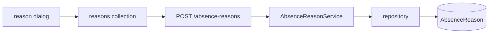

# Pull Request

1. Review the whole branch, not just the last commit: `git log --oneline origin/main..HEAD` and `git diff origin/main...HEAD`.
2. If the branch has a plan file (`plans/*.md`), read it — the "why" and the locked decisions live there, reuse them.
3. Check for an existing PR with `gh pr view --json number,title,body`. If one exists, update it with `gh pr edit`; otherwise create it with `gh pr create`.
4. Draft the title and body, then create or update the PR and print its URL.

When the branch is `main`, create a feature branch named `<type>/<short-description>` and push it with `-u` before opening the PR. Never push to `main`, and never force-push without asking first.

## Title

Under 60 characters, imperative, no trailing period, no conventional-commit prefix — `Remove unused spass package`, not `fix: some changes`.

## The rule

**The reviewer can already see which files changed. Explain what they can't see: why, and how the pieces call each other.**

Write for someone who will read the diff after your description, and needs to know what to look for.

## Body

```markdown
## Why

<1-3 sentences or bullets. The problem, as a failure story — what breaks or
hurts today. Not "the model lacked a category field" but "reasons were free
text, so nothing downstream could tell sick leave from a school trip.">

## What changes

<2-5 bullets of behavior, in user/system terms. What the system does now that
it didn't before. No file paths unless a path IS the point (new package,
deleted module).>

## Flow

<A mermaid diagram or an arrow chain of the path through the code.
Entry point → service → dependency → store. Mark the new/changed hops.
Skip only if the change is genuinely flat (config bump, copy edit).>

## Decisions

<Only non-obvious ones. Each: the choice, the rejected alternative, and the
failure that made you reject it. Skip the section if there were none.>

## Watch out

<Migrations, backfills, breaking API changes, manual deploy steps, follow-ups
deliberately left out of scope. Skip if none.>
```

Adapt: drop sections that would be empty. A one-line fix gets **Why** and nothing else.

### Flow examples

Arrow chain for a linear path:

```
POST /absence-reasons  →  AbsenceReasonService.create  →  Model.register (+category)
                       →  AbsenceReasonRepository.create  →  AbsenceReason.category (NOT NULL)
```

Mermaid when it branches or loops:



## Never

- A per-file or per-area table of changes. That's `git diff --stat` with extra words.
- Restating the diff ("added `category` to the interface, added it to the mapper, added it to the payload"). Say it once, at the level of the flow.
- Test plans, generated-by footers, emoji headers — unless asked.
- Padding a small PR into the full template.

## Posting

Pass the body via a quoted HEREDOC so formatting and backticks survive:

```bash
gh pr create --title "<title>" --body "$(cat <<'EOF'
<body>
EOF
)"
```
